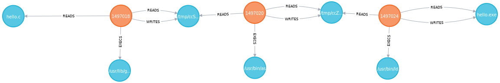
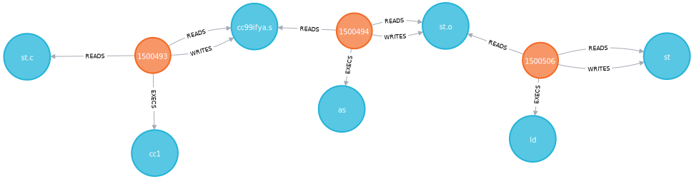
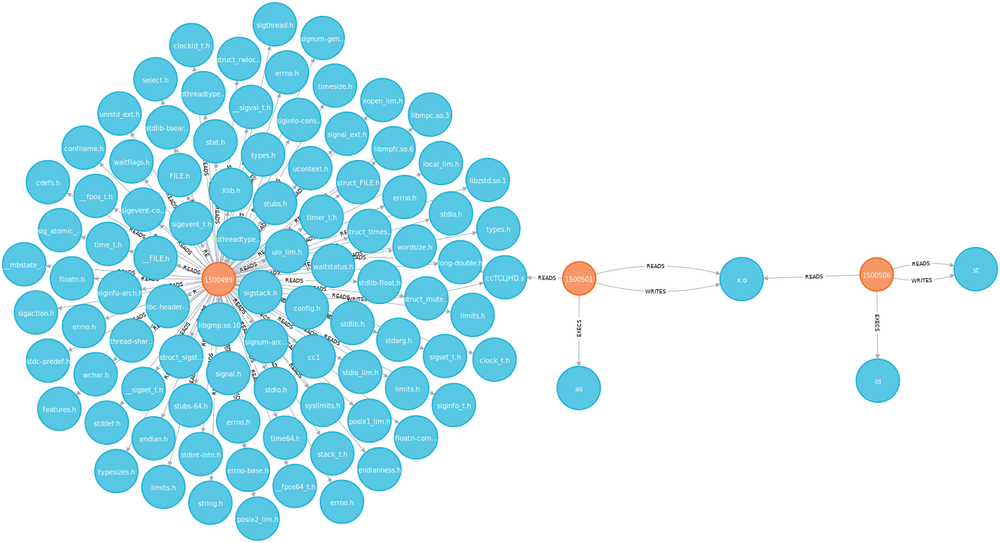

# Demo

## Results

Read the graphs from left to right.

### Hello World

`hello.c` is read by the compiler process (PID: 779338).

`hello.c` is read by the compiler process (PID: 1497018), which produces a file
of assembly code that is assembled by the assembler process (PID: 1497020),
which produces an object file, which is finally read by the linker process (PID:
1497024) which produces the executable `hello.exe`.

### st

`st.c` is read by the compiler process (PID: 1500493), which produces a file
of assembly code that is assembled by the assembler process (PID: 1500494),
which produces an object file, which is finally read by the linker process (PID:
1497024) which produces the executable `st`.

The compiler process (PID: 1500499) reads a number of header files and shared
libraries to produce a file of assembly code, which is read by the assembler
(PID: 1500501) to produce an object file, which is in turn read by the linker
process (PID: 1500506), which finally writes the executable `st`.

